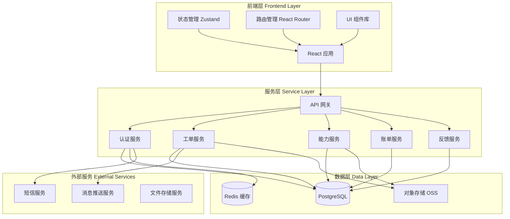
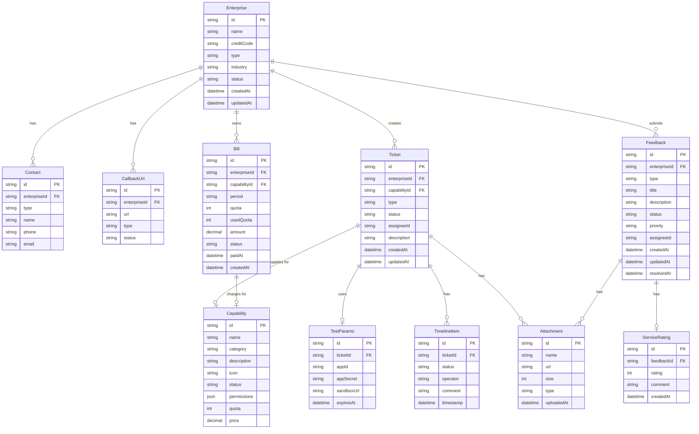

# 开放能力伙伴门户 - 技术架构文档

## 1. 架构设计



## 2. 技术描述

### 2.1 前端技术栈

- **框架**: React 18.3.1
- **构建工具**: Vite 5.4.0
- **样式方案**: Tailwind CSS 3.4.0
- **路由管理**: React Router DOM 6.26.0
- **状态管理**: Zustand 4.5.0
- **HTTP 客户端**: Axios 1.7.0
- **UI 组件**: 自定义组件 + Lucide React Icons
- **表单处理**: React Hook Form 7.52.0
- **数据验证**: Zod 3.23.0
- **日期处理**: date-fns 3.6.0
- **图表可视化**: Recharts 2.12.0
- **代码高亮**: Prism React Renderer 2.3.0

### 2.2 后端技术栈（模拟数据）

本项目采用前端模拟数据方案，使用 Mock Service Worker (MSW) 模拟后端 API，便于快速开发和演示。

- **API 模拟**: MSW 2.3.0
- **数据存储**: LocalStorage + 内存存储
- **文件处理**: 前端模拟上传

### 2.3 开发工具

- **包管理器**: pnpm 9.0.0
- **代码规范**: ESLint 9.0.0 + Prettier 3.3.0
- **类型检查**: TypeScript 5.5.0
- **Git 提交规范**: Commitlint + Husky

## 3. 路由定义

| 路由路径 | 页面名称 | 功能描述 |
|----------|----------|----------|
| `/` | 首页 | 门户首页，展示平台介绍和快速入口 |
| `/apply` | 入驻申请页 | 企业入驻申请表单填写 |
| `/review` | 资质审核页 | 审核进度跟踪和资料补充 |
| `/capabilities` | 能力广场页 | 可接入能力浏览和详情查看 |
| `/tickets` | 接入工单页 | 工单列表和工单管理 |
| `/tickets/create` | 创建工单页 | 新建接入工单表单 |
| `/tickets/:id` | 工单详情页 | 单个工单详情和操作 |
| `/sandbox` | 测试沙箱页 | 测试环境和联调工具 |
| `/acceptance` | 上线验收页 | 验收申请和验收管理 |
| `/billing` | 账单中心页 | 配额查看和账单管理 |
| `/feedback` | 服务评价页 | 问题反馈和服务评分 |

## 4. API 定义

### 4.1 数据类型定义

```typescript
// 企业信息
interface Enterprise {
  id: string;
  name: string;
  creditCode: string;
  type: 'technology' | 'finance' | 'retail' | 'manufacturing' | 'other';
  industry: string;
  status: 'pending' | 'approved' | 'rejected' | 'suspended';
  createdAt: string;
  updatedAt: string;
}

// 联系人信息
interface Contact {
  id: string;
  enterpriseId: string;
  type: 'technical' | 'business' | 'emergency';
  name: string;
  phone: string;
  email: string;
}

// 回调地址
interface CallbackUrl {
  id: string;
  enterpriseId: string;
  url: string;
  type: 'notification' | 'event' | 'data';
  status: 'active' | 'inactive';
}

// 能力信息
interface Capability {
  id: string;
  name: string;
  category: 'account' | 'content' | 'message' | 'data';
  description: string;
  icon: string;
  status: 'available' | 'applied' | 'active' | 'suspended';
  permissions: string[];
  quota: number;
  price: number;
}

// 工单信息
interface Ticket {
  id: string;
  enterpriseId: string;
  capabilityId: string;
  capabilityName: string;
  type: 'access' | 'upgrade' | 'maintenance' | 'cancel';
  status: 'draft' | 'submitted' | 'assigned' | 'testing' | 'reviewing' | 'approved' | 'rejected';
  assignee?: {
    id: string;
    name: string;
    avatar: string;
    phone: string;
  };
  description: string;
  attachments: Attachment[];
  timeline: TimelineItem[];
  createdAt: string;
  updatedAt: string;
}

// 时间线项
interface TimelineItem {
  id: string;
  status: string;
  operator: string;
  comment?: string;
  timestamp: string;
}

// 测试参数
interface TestParams {
  id: string;
  ticketId: string;
  appId: string;
  appSecret: string;
  testAccounts: TestAccount[];
  sandboxUrl: string;
  expiresAt: string;
}

// 测试账号
interface TestAccount {
  id: string;
  username: string;
  password: string;
  type: 'admin' | 'user';
}

// 账单信息
interface Bill {
  id: string;
  enterpriseId: string;
  capabilityId: string;
  capabilityName: string;
  period: string;
  quota: number;
  usedQuota: number;
  amount: number;
  status: 'unpaid' | 'paid' | 'overdue';
  paidAt?: string;
  createdAt: string;
}

// 反馈信息
interface Feedback {
  id: string;
  enterpriseId: string;
  type: 'technical' | 'business' | 'billing' | 'other';
  title: string;
  description: string;
  attachments: Attachment[];
  status: 'pending' | 'processing' | 'resolved' | 'closed';
  priority: 'low' | 'medium' | 'high' | 'urgent';
  assignee?: string;
  createdAt: string;
  updatedAt: string;
  resolvedAt?: string;
}

// 服务评分
interface ServiceRating {
  id: string;
  feedbackId: string;
  rating: number; // 1-5 stars
  comment: string;
  createdAt: string;
}

// 附件
interface Attachment {
  id: string;
  name: string;
  url: string;
  size: number;
  type: string;
  uploadedAt: string;
}
```

### 4.2 API 接口定义

#### 企业管理

```typescript
// GET /api/enterprises/:id
// 获取企业信息
Response: Enterprise

// PUT /api/enterprises/:id
// 更新企业信息
Request: Partial<Enterprise>
Response: Enterprise

// POST /api/enterprises
// 创建企业入驻申请
Request: {
  name: string;
  creditCode: string;
  type: string;
  industry: string;
  contacts: Contact[];
  callbackUrls: CallbackUrl[];
  attachments: Attachment[];
}
Response: Enterprise
```

#### 能力管理

```typescript
// GET /api/capabilities
// 获取能力列表
Query: { category?: string; status?: string }
Response: Capability[]

// GET /api/capabilities/:id
// 获取能力详情
Response: Capability & {
  documentation: string;
  apiSpec: object;
  examples: object[];
}
```

#### 工单管理

```typescript
// GET /api/tickets
// 获取工单列表
Query: { status?: string; capabilityId?: string }
Response: Ticket[]

// GET /api/tickets/:id
// 获取工单详情
Response: Ticket

// POST /api/tickets
// 创建工单
Request: {
  capabilityId: string;
  type: string;
  description: string;
  attachments: Attachment[];
}
Response: Ticket

// PUT /api/tickets/:id
// 更新工单
Request: Partial<Ticket>
Response: Ticket

// POST /api/tickets/:id/submit
// 提交工单
Response: Ticket

// POST /api/tickets/:id/submit-test-result
// 提交联调结果
Request: {
  success: boolean;
  screenshots: Attachment[];
  description: string;
}
Response: Ticket
```

#### 测试沙箱

```typescript
// GET /api/test-params/:ticketId
// 获取测试参数
Response: TestParams

// POST /api/test-params/:ticketId/regenerate
// 重新生成测试参数
Response: TestParams

// POST /api/sandbox/test
// 沙箱接口测试
Request: {
  method: string;
  path: string;
  headers: object;
  body?: object;
}
Response: {
  status: number;
  headers: object;
  body: object;
  duration: number;
}
```

#### 账单管理

```typescript
// GET /api/bills
// 获取账单列表
Query: { status?: string; period?: string }
Response: Bill[]

// GET /api/bills/:id
// 获取账单详情
Response: Bill

// POST /api/bills/:id/pay
// 支付账单
Request: { paymentMethod: string }
Response: Bill

// POST /api/capabilities/:id/renew
// 续费能力
Request: { period: number }
Response: Bill

// POST /api/capabilities/:id/suspend
// 停用能力
Request: { reason: string }
Response: Capability
```

#### 反馈管理

```typescript
// GET /api/feedbacks
// 获取反馈列表
Query: { status?: string; type?: string }
Response: Feedback[]

// GET /api/feedbacks/:id
// 获取反馈详情
Response: Feedback

// POST /api/feedbacks
// 创建反馈
Request: {
  type: string;
  title: string;
  description: string;
  attachments: Attachment[];
}
Response: Feedback

// POST /api/feedbacks/:id/rating
// 提交服务评分
Request: {
  rating: number;
  comment: string;
}
Response: ServiceRating
```

## 5. 数据模型

### 5.1 数据模型定义



## 6. 项目目录结构

```
open-capability-portal/
├── public/
│   └── favicon.ico
├── src/
│   ├── assets/
│   │   ├── images/
│   │   └── icons/
│   ├── components/
│   │   ├── common/
│   │   │   ├── Button/
│   │   │   ├── Card/
│   │   │   ├── Form/
│   │   │   ├── Table/
│   │   │   ├── Modal/
│   │   │   ├── Badge/
│   │   │   ├── Timeline/
│   │   │   ├── Progress/
│   │   │   ├── Upload/
│   │   │   └── Empty/
│   │   ├── layout/
│   │   │   ├── Header/
│   │   │   ├── Sidebar/
│   │   │   ├── Layout/
│   │   │   └── Footer/
│   │   └── business/
│   │       ├── CapabilityCard/
│   │       ├── TicketCard/
│   │       ├── BillCard/
│   │       ├── FeedbackCard/
│   │       └── RatingStars/
│   ├── pages/
│   │   ├── Home/
│   │   ├── Apply/
│   │   ├── Review/
│   │   ├── Capabilities/
│   │   ├── Tickets/
│   │   ├── TicketCreate/
│   │   ├── TicketDetail/
│   │   ├── Sandbox/
│   │   ├── Acceptance/
│   │   ├── Billing/
│   │   └── Feedback/
│   ├── hooks/
│   │   ├── useEnterprise.ts
│   │   ├── useCapabilities.ts
│   │   ├── useTickets.ts
│   │   ├── useBills.ts
│   │   └── useFeedback.ts
│   ├── stores/
│   │   ├── enterpriseStore.ts
│   │   ├── capabilityStore.ts
│   │   ├── ticketStore.ts
│   │   └── userStore.ts
│   ├── services/
│   │   ├── api/
│   │   │   ├── enterprise.ts
│   │   │   ├── capability.ts
│   │   │   ├── ticket.ts
│   │   │   ├── bill.ts
│   │   │   └── feedback.ts
│   │   └── mock/
│   │       ├── handlers/
│   │       ├── data/
│   │       └── browser.ts
│   ├── utils/
│   │   ├── format.ts
│   │   ├── validate.ts
│   │   ├── request.ts
│   │   └── constants.ts
│   ├── types/
│   │   ├── enterprise.ts
│   │   ├── capability.ts
│   │   ├── ticket.ts
│   │   ├── bill.ts
│   │   └── feedback.ts
│   ├── styles/
│   │   └── globals.css
│   ├── App.tsx
│   ├── main.tsx
│   └── vite-env.d.ts
├── index.html
├── package.json
├── tsconfig.json
├── vite.config.ts
├── tailwind.config.js
└── README.md
```

## 7. 关键技术实现

### 7.1 状态管理

使用 Zustand 进行轻量级状态管理，每个业务域独立 store：

```typescript
// stores/ticketStore.ts
import { create } from 'zustand';

interface TicketState {
  tickets: Ticket[];
  currentTicket: Ticket | null;
  loading: boolean;
  fetchTickets: () => Promise<void>;
  createTicket: (data: Partial<Ticket>) => Promise<Ticket>;
  updateTicket: (id: string, data: Partial<Ticket>) => Promise<Ticket>;
}

export const useTicketStore = create<TicketState>((set, get) => ({
  tickets: [],
  currentTicket: null,
  loading: false,
  fetchTickets: async () => {
    set({ loading: true });
    const tickets = await ticketService.getTickets();
    set({ tickets, loading: false });
  },
  createTicket: async (data) => {
    const ticket = await ticketService.createTicket(data);
    set({ tickets: [...get().tickets, ticket] });
    return ticket;
  },
  updateTicket: async (id, data) => {
    const ticket = await ticketService.updateTicket(id, data);
    set({
      tickets: get().tickets.map(t => t.id === id ? ticket : t),
      currentTicket: get().currentTicket?.id === id ? ticket : get().currentTicket
    });
    return ticket;
  }
}));
```

### 7.2 路由守卫

实现路由权限控制，保护需要登录的页面：

```typescript
// components/AuthGuard.tsx
import { Navigate, useLocation } from 'react-router-dom';
import { useUserStore } from '@/stores/userStore';

export function AuthGuard({ children }: { children: React.ReactNode }) {
  const { isAuthenticated } = useUserStore();
  const location = useLocation();

  if (!isAuthenticated) {
    return <Navigate to="/login" state={{ from: location }} replace />;
  }

  return <>{children}</>;
}
```

### 7.3 API 请求封装

统一请求拦截器，处理认证和错误：

```typescript
// utils/request.ts
import axios from 'axios';
import { useUserStore } from '@/stores/userStore';

const request = axios.create({
  baseURL: import.meta.env.VITE_API_BASE_URL,
  timeout: 10000,
});

request.interceptors.request.use((config) => {
  const token = useUserStore.getState().token;
  if (token) {
    config.headers.Authorization = `Bearer ${token}`;
  }
  return config;
});

request.interceptors.response.use(
  (response) => response.data,
  (error) => {
    if (error.response?.status === 401) {
      useUserStore.getState().logout();
    }
    return Promise.reject(error);
  }
);

export default request;
```

### 7.4 Mock 数据服务

使用 MSW 模拟后端 API：

```typescript
// services/mock/handlers/ticket.ts
import { http, HttpResponse, delay } from 'msw';
import { mockTickets } from '../data/tickets';

export const ticketHandlers = [
  http.get('/api/tickets', async () => {
    await delay(300);
    return HttpResponse.json(mockTickets);
  }),
  
  http.post('/api/tickets', async ({ request }) => {
    await delay(500);
    const body = await request.json();
    const newTicket = {
      id: `ticket-${Date.now()}`,
      ...body,
      status: 'draft',
      createdAt: new Date().toISOString(),
      updatedAt: new Date().toISOString(),
    };
    mockTickets.push(newTicket);
    return HttpResponse.json(newTicket);
  }),
];
```

## 8. 性能优化策略

### 8.1 代码分割

- 路由级别懒加载
- 第三方库按需引入
- 组件动态导入

### 8.2 数据缓存

- React Query 缓存 API 响应
- LocalStorage 持久化关键数据
- 内存缓存减少重复请求

### 8.3 渲染优化

- 虚拟列表处理大数据量
- useMemo/useCallback 减少重渲染
- 图片懒加载

### 8.4 打包优化

- Vite 自动代码分割
- Tree Shaking 移除未使用代码
- 压缩和混淆

## 9. 安全策略

### 9.1 认证授权

- JWT Token 认证
- Token 自动刷新
- 权限路由守卫

### 9.2 数据安全

- HTTPS 强制加密
- 敏感数据脱敏显示
- XSS/CSRF 防护

### 9.3 文件上传

- 文件类型白名单
- 文件大小限制
- 病毒扫描（后端）

## 10. 部署方案

### 10.1 开发环境

```bash
pnpm install
pnpm dev
```

### 10.2 生产构建

```bash
pnpm build
pnpm preview
```

### 10.3 Docker 部署

```dockerfile
FROM node:20-alpine as builder
WORKDIR /app
COPY package.json pnpm-lock.yaml ./
RUN npm install -g pnpm && pnpm install
COPY . .
RUN pnpm build

FROM nginx:alpine
COPY --from=builder /app/dist /usr/share/nginx/html
COPY nginx.conf /etc/nginx/nginx.conf
EXPOSE 80
CMD ["nginx", "-g", "daemon off;"]
```